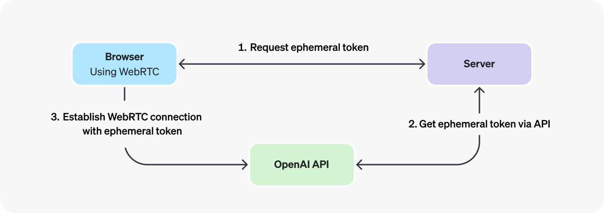

GOAL 
*** This project is a web application for an AI assistant which can hear a online conversation(i.e; zoom, chime ,teams etc) and assist the user with information to speak about the topic, answer any questions asked by the participant. The assistant takes audio,text and in some cases image as input. We are using openAI's realtime API's and Assistant's API to acheive realtime responses and task specific responses.We establish connection for realtime API's to our web client through webRTC and use ephemeral tokens to validate the request. ***

` This will be a electron application and will be run on macOS. please keep this in mind while working with connection details ,input audio from user and speaker ,  streaming audio input to the server etc. @electron-main.js `

entities here are :
`user` : who is using the application
`speaker`/ `participant` : who the user is on the call with and talking to the user
`assistant` : who is the assistant for the user

`Realtime API`

     * Build low-latency, multi-modal experiences with the Realtime API.
     * The OpenAI Realtime API enables low-latency, multimodal interactions including speech-to-speech   conversational experiences and real-time transcription.
     * This API works with natively multimodal models such as GPT-4o and GPT-4o mini, offering capabilities such as real-time text and audio processing, function calling, and speech generation, and with the latest transcription models GPT-4o Transcribe and GPT-4o mini Transcribe.

`STEPS` 

1. we are using the webRTC connection method to connect to the web client and establish a connection with the realtime API.

    * Using WebRTC, which is ideal for client-side applications (for example, a web app) https://platform.openai.com/docs/guides/realtime#connect-with-webrtc
    * In scenarios where you would like to connect to a Realtime model from an insecure client over the network (like a web browser), we recommend using the WebRTC connection method. WebRTC is better equipped to handle variable connection states, and provides a number of convenient APIs for capturing user audio inputs and playing remote audio streams from the model.
    * Connecting to the Realtime API from the browser should be done with an ephemeral API key, generated via the OpenAI REST API. The process for initializing a WebRTC connection is as follows (assuming a web browser client):
    * A browser makes a request to a developer-controlled server to mint an ephemeral API key.
    * The developer's server uses a standard API key to request an ephemeral key from the OpenAI REST API, and returns that new key to the browser. Note that ephemeral keys currently expire one minute after being issued.
    * The browser uses the ephemeral key to authenticate a session directly with the OpenAI Realtime API as a WebRTC peer connection.

    * **Session Time Limits:** Be aware that Realtime API sessions have limitations. They currently have a maximum duration of ~30 minutes and may also time out due to inactivity (e.g., 15 minutes). We'll need a strategy to handle sessions longer than this limit, likely involving creating new sessions and transferring context. (Ref: OpenAI Community discussions).

    * Connection details : https://platform.openai.com/docs/guides/realtime#connection-details , https://platform.openai.com/docs/guides/realtime#creating-an-ephemeral-token 
     
     

2 .Audio input is done separetly i.e; user's audio is given through an custom audio input device which uses blackhole audio (@https://github.com/ExistentialAudio/BlackHole ) to virtually route audio thrrough microphone and blackhole. similarly ouput is routed to mac speakers and blackhole. 
    * There is no audio ouput from realtime api in response and is not required. 
    * The requirements for audio input for the API's are pcm16(default), g711_ulaw and g711_alaw.
    * input_audio_transcription.language: The language to use for the transcription, ideally in ISO-639-1 format (e.g. "en", "fr"...) to improve accuracy and latency.
    * Currently we are using a regular session instead of a dedicated transcription session. Regular session can also provide a response based on the audio input where as dedicated transcription session is used for realtime transcription.
    * we are having two realtime api's running in parallel, one for audio input and one for text input.

    Handling audio input : blackhole audio (https://github.com/ExistentialAudio/BlackHole ) which needs to resampled as per the realtime api's requirements.

    Handling audio with webrtc : https://platform.openai.com/docs/guides/realtime-conversations#handling-audio-with-webrtc
    Client and server events for audio in WebRTC : https://platform.openai.com/docs/guides/realtime-conversations#client-and-server-events-for-audio-in-webrtc
    Streaming audio input to the server : https://platform.openai.com/docs/guides/realtime-conversations#streaming-audio-input-to-the-server
    Voice activity detection : https://platform.openai.com/docs/guides/realtime-conversations#voice-activity-detection
create responses outside of default conversation : https://platform.openai.com/docs/guides/realtime-conversations#create-responses-outside-the-default-conversation
Streaming the transcription of an ongoing audio recording : https://platform.openai.com/docs/guides/speech-to-text#streaming-the-transcription-of-an-ongoing-audio-recording

    *** Identified Issues (To Be Addressed): ***
    1.  **Mismatched Session Configs:** Backend (`/api/realtime-token`) creates only one session type, but frontend needs two ('mic' vs 'speaker' with different parameters).
    2.  **Unused Frontend Session Config:** `connectionManager.connect` doesn't pass the intended session config to the backend when requesting the token.
    3.  **Incorrect Audio Format:** The resampling worklet (`resampling-processor.ts`) outputs Float32 audio, but OpenAI requires PCM16 (`Int16Array`).

*** Progress Update (Current Date/Time - Replace Me!) ***

*   **Audio Input Setup:** Decided to use Loopback instead of Blackhole for capturing speaker audio (from Chrome). User configured a Loopback virtual device named `systemAudio` to capture Chrome audio (mixed to dual mono) and monitor it.
    *   **COMPLETED:** Updated `src/app/components/TopControls.tsx` (`connectSpeaker` function) to select the `systemAudio` device via `getUserMedia`.
    *   **COMPLETED:** Confirmed `src/app/components/TopControls.tsx` (`connectMic` function) correctly selects the physical microphone via `getUserMedia`.

*   **Issue 1 (Mismatched Session Configs - Backend):**
    *   **COMPLETED:** Reviewed `src/app/api/realtime-token/route.ts`. Confirmed it *already* handles different `sessionType` values ('mic'/'speaker') and correctly merges `sessionConfig` sent from the frontend. This issue is resolved.

*   **Issue 2 (Unused Frontend Session Config):**
    *   **COMPLETED:** Reviewed `src/app/components/TopControls.tsx`. Confirmed it *is* correctly passing the distinct session configs (`micSessionConfig_AuxAssistant` and `speakerSessionConfig_Transcription`) to the `connectionManager.connect` function. This issue is resolved.

*   **Issue 3 (Incorrect Audio Format):**
    *   **PENDING:** Reviewed `public/worklets/resampling-processor.js`. Confirmed it currently outputs Float32 audio. 
    *   **NEXT STEP:** Modify `resampling-processor.js` to convert resampled audio to PCM16 (Int16) and send the `Int16Array` data back to the main thread via `this.port.postMessage()`. 
    *   **NEXT STEP:** Modify `src/app/components/TopControls.tsx` to listen for messages from the worklet, receive the `Int16Array` data, and adapt the `connectionManager.connect` call or subsequent data handling to use this raw PCM16 data instead of relying on the `MediaStreamTrack` from the `MediaStreamAudioDestinationNode`.

Our goal here: 

1. To get realtime trancription of speaker's real-time audio and use the transciption to create a run for the assistant.
2. Add the speaker's transcription as a conversation item to user's conversation.
3. Get transcription of user's audio, use it to create a message for the assistant.
4. when speaker's transcription is added to conversation  item for user , use it to provide a quick response to the user in text format before the assistant's response.
5. No audio ouput from realtime api in response and is not required for both user and speaker.  

