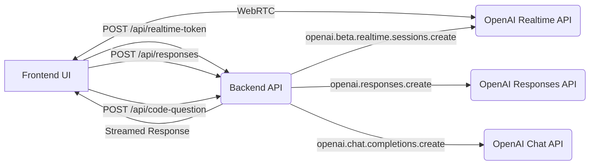
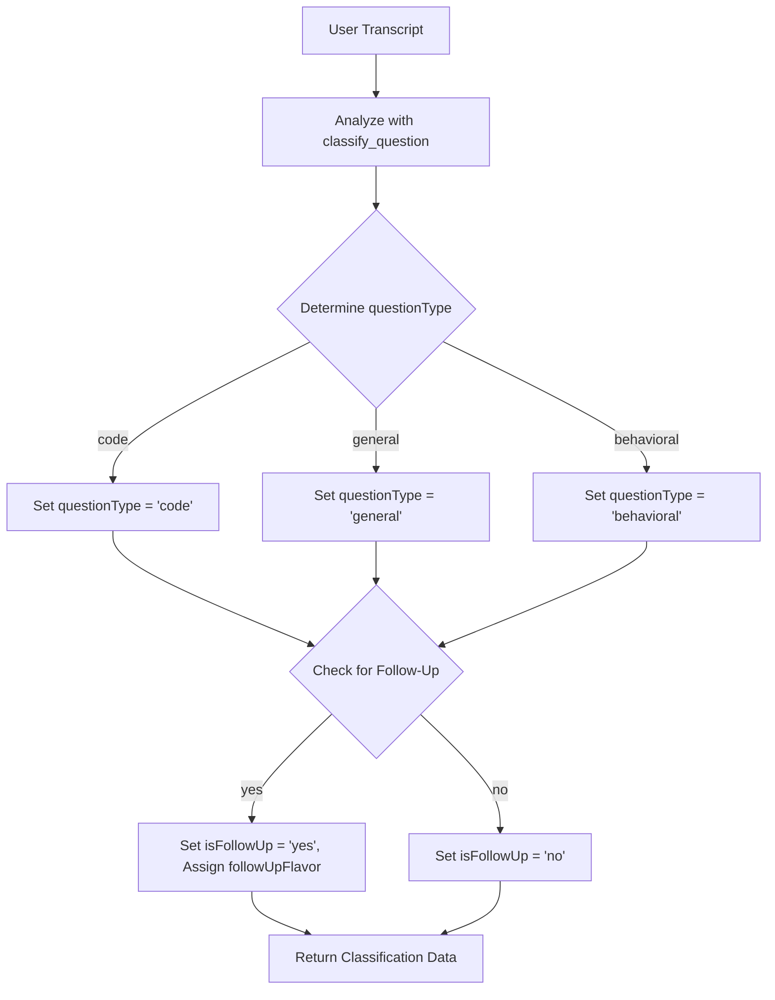
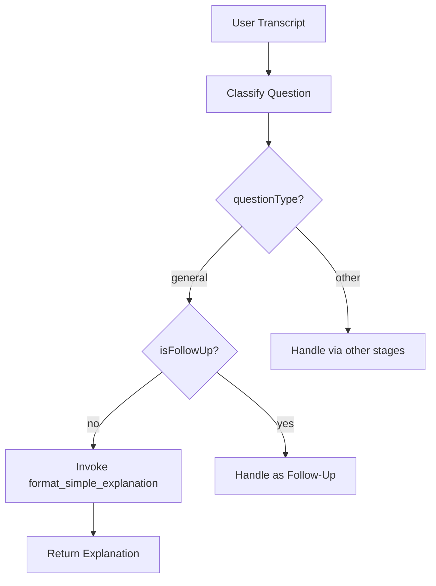
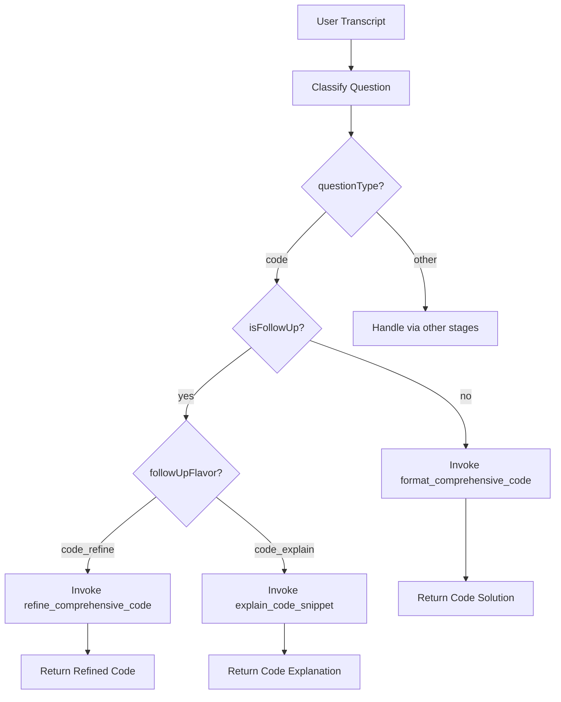
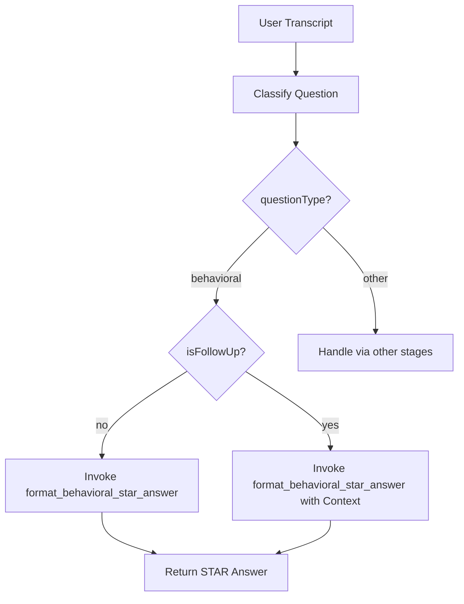

# AgentAssist Application Flow Overview

This document provides a detailed overview of the AgentAssist application, tracing the process from audio input to response generation for different types of questions (code, general, and behavioral). It outlines the key stages, components, and decision flows involved in handling user interactions, leveraging the OpenAI Responses API framework.

## Overall System Architecture

The AgentAssist application integrates frontend and backend components with OpenAI's APIs to process audio input, classify questions, and generate tailored responses. The high-level architecture is as follows:



## Detailed Flow: From Audio Input to Response Generation

### 1. Audio Input and Transcription

- **Audio Capture:** The application captures user microphone input and system speaker output using browser WebRTC capabilities.
- **Streaming to OpenAI Realtime API:** Audio data is streamed directly to the OpenAI Realtime API for transcription via a WebRTC connection managed by [`src/app/api/realtime-assistant-webRTC/webRTCConnectionManager.ts`](src/app/api/realtime-assistant-webRTC/webRTCConnectionManager.ts:0).
- **Transcript Generation:** The OpenAI Realtime API processes the audio and generates transcripts for both user and system audio, which are sent back to the frontend.

### 2. Transcript Processing and Backend Request

- **Frontend Handling:** Upon completion of system audio transcription, the transcript is displayed in the UI via [`src/components/Transcript.tsx`](src/components/Transcript.tsx:0) and sent to the backend for processing through a `POST /api/responses` request.
- **Backend Entry Point:** The backend endpoint [`src/app/api/responses/route.ts`](src/app/api/responses/route.ts:0) receives the transcript and initiates the classification process.

### 3. Classification (Stage 1)

- **Classification Tool Invocation:** The backend uses the `classify_question` tool with `openai.chat.completions.create` (`gpt-4o-mini`) to categorize the transcript into 'code', 'general', or 'behavioral' and detect if it's a follow-up.
- **Context Check for Follow-Ups:** The system checks the `conversationContextStore` (an in-memory `Map`) for `lastQuestionType` and analyzes keywords to determine follow-up status and flavor.
- **Output:** Classification results include `questionType`, `isFollowUp`, and `followUpFlavor` (if applicable), which guide subsequent tool selection.

**Classification Flow Diagram:**


### 4. Response Generation Based on Question Type

The backend selects the appropriate tool and model based on classification results and invokes them via `openai.responses.create`. The response is streamed back to the frontend for display.

#### 4.1 General Question Handling (Stage 2)

- **Condition:** `questionType` is 'general' and `isFollowUp` is 'no'.
- **Tool and Model:** Invokes `format_simple_explanation` with `gpt-4.1-mini-2025-04-14`.
- **Process:** The user’s prompt is passed directly to the tool to generate a concise explanation.
- **Endpoint:** Handled via `/api/v2/classify_and_explain_general` (test endpoint for migration).
- **Output:** A clear, straightforward response is returned.

**General Question Flow Diagram:**


#### 4.2 Code Question Handling (Stage 3)

- **Condition:** `questionType` is 'code'.
- **Tool and Model Selection:**
  - If `isFollowUp` is 'no': Invokes `format_comprehensive_code` with `gpt-4o-mini` to generate a full code solution.
  - If `isFollowUp` is 'yes' and `followUpFlavor` is 'code_refine': Invokes `refine_comprehensive_code` to apply patches/optimizations to the last code snippet retrieved from `conversationContextStore`.
  - If `isFollowUp` is 'yes' and `followUpFlavor` is 'code_explain': Invokes `explain_code_snippet` to explain a specific portion of the last code snippet.
- **Endpoint:** Handled via `/api/v2/classify_and_handle_code` (test endpoint for migration).
- **Output:** Responses (code solutions, refined code, or explanations) are returned.

**Code Question Flow Diagram:**


#### 4.3 Behavioral Question Handling (Stage 4)

- **Condition:** `questionType` is 'behavioral'.
- **Tool and Model:** Invokes `format_behavioral_star_answer` with `gpt-4o-mini` to structure responses using the STAR method.
- **Process:** For new questions, the user’s prompt is passed directly. For follow-ups, prior assistant responses are retrieved from `conversationContextStore` to maintain context.
- **Endpoint:** Handled via `/api/v2/classify_and_handle_behavioral` (test endpoint for migration).
- **Output:** A structured STAR response is returned.

**Behavioral Question Flow Diagram:**


### 5. UI Handling for Responses

The application is designed to run in a potentially compact, resizable window, rather than assuming a full-screen browser tab. Within this window, it features a multi-view interface managed by [`src/components/DraggablePanelLayout.tsx`](src/components/DraggablePanelLayout.tsx:0) to present different types of responses effectively. User and assistant messages, including general explanations, are primarily displayed in a chat-like interface within the **Main View**, managed by [`src/components/Transcript.tsx`](src/components/Transcript.tsx:0).

-   **General Responses:**
    -   Displayed directly within the main conversation transcript in the **Main View**.
    -   The [`src/components/Transcript.tsx`](src/components/Transcript.tsx:0) component renders these messages as part of the ongoing dialogue.
    -   **UI Panel Arrangement (General Response):**
        ```mermaid
        graph TD
            subgraph ApplicationWindow["Application Window (Resizable)"]
                subgraph DraggablePanelLayout
                    direction LR
                    MainView["Main View (Active)"]
                    subgraph MainView
                        direction TB
                        Transcript["Transcript.tsx (Displays General Explanation)"]
                    end
                    CodeView["Code View (Inactive)"]
                    BehavioralView["Behavioral View (Inactive)"]
                end
            end
        ```

-   **Code Responses:**
    -   When a code-related response is generated (new code, refined code, or code explanation), the UI typically switches to or emphasizes the **Code View**.
    -   The **Code View** consists of:
        -   [`EnhancedCodePane.tsx`](src/components/EnhancedCodePane.tsx:0): Displays the actual code snippet with syntax highlighting and formatting.
        -   [`EnhancedAnalysisPane.tsx`](src/components/EnhancedAnalysisPane.tsx:0): Displays explanations or analysis related to the code.
    -   Multiple code snippets and their analyses can be managed using tabs, handled by [`TabsPanel.tsx`](src/components/TabsPanel.tsx:0) within this view.
    -   The system may automatically switch to the Code View or a relevant tab when a code response is ready.
    -   **UI Panel Arrangement (Code Response):**
        ```mermaid
        graph TD
            subgraph ApplicationWindow_C["Application Window (Resizable)"]
                subgraph DraggablePanelLayout_C["DraggablePanelLayout"]
                    direction LR
                    MainView_C["Main View (Can be active or inactive)"]
                    CodeView_C["Code View (Active)"]
                    subgraph CodeView_C
                        direction TB
                        Tabs_C["TabsPanel.tsx"]
                        Pane_Code["EnhancedCodePane.tsx (Displays Code)"]
                        Pane_Analysis_C["EnhancedAnalysisPane.tsx (Displays Analysis/Explanation)"]
                    end
                    BehavioralView_C["Behavioral View (Inactive)"]
                end
            end
        ```

-   **Behavioral Responses:**
    -   STAR method answers for behavioral questions are presented in the **Behavioral View**.
    -   This view utilizes the [`EnhancedAnalysisPane.tsx`](src/components/EnhancedAnalysisPane.tsx:0) to display the structured STAR answer (Situation, Task, Action, Result).
    -   Similar to the Code View, tabs managed by [`TabsPanel.tsx`](src/components/TabsPanel.tsx:0) can be used if multiple behavioral scenarios or answers need to be accessible.
    -   The UI may automatically switch to the Behavioral View or a relevant tab upon receiving a behavioral response.
    -   **UI Panel Arrangement (Behavioral Response):**
        ```mermaid
        graph TD
            subgraph ApplicationWindow_B["Application Window (Resizable)"]
                subgraph DraggablePanelLayout_B["DraggablePanelLayout"]
                    direction LR
                    MainView_B["Main View (Can be active or inactive)"]
                    CodeView_B["Code View (Inactive)"]
                    BehavioralView_B["Behavioral View (Active)"]
                    subgraph BehavioralView_B
                        direction TB
                        Tabs_B["TabsPanel.tsx"]
                        Pane_Analysis_B["EnhancedAnalysisPane.tsx (Displays STAR Answer)"]
                    end
                end
            end
        ```

-   **View Switching:**
    -   View switching between Main, Code, and Behavioral views can be triggered manually by the user (e.g., using a shortcut like Alt+Space) or automatically by the application when a specific type of response is generated and needs to be displayed in its dedicated view.

### 6. Context Management and Storage

- **Conversation Context Store:** An in-memory `Map` (`conversationContextStore`) stores conversation history keyed by `conversationId`. Only assistant messages (final function call outputs) are persisted to maintain context for follow-ups.
- **Non-Persisted Data:** User and system audio transcripts are not stored in the backend context between requests; they are passed into API calls as needed, relying on OpenAI session state for immediate turn context.

### 7. Frontend Display and User Interaction (General)

- **Transcript Display:** User and assistant messages are shown in a chat-like interface managed by [`src/components/Transcript.tsx`](src/components/Transcript.tsx:0) and [`src/contexts/TranscriptContext.tsx`](src/contexts/TranscriptContext.tsx:0).
- **Multi-View Interface:** Responses are displayed in appropriate views (Main, Code, or Behavioral) using resizable panels in [`src/components/DraggablePanelLayout.tsx`](src/components/DraggablePanelLayout.tsx:0). View switching can be manual (Alt+Space) or automatic based on tab selection.
- **Additional Input Method:** For code questions involving visuals, users can capture screenshots and send them with text questions via `POST /api/code-question`, processed using OpenAI's vision capabilities (`gpt-4o-mini`).

### 8. Key Components and Modules

- **Frontend Orchestration:** [`src/app/App.tsx`](src/app/App.tsx:0) manages main application logic and state.
- **UI Controls:** [`src/components/TopControls.tsx`](src/components/TopControls.tsx:0) handles WebRTC connections, mic mute, settings, and screenshot triggers.
- **Backend Logic:** [`src/app/api/responses/route.ts`](src/app/api/responses/route.ts:0) orchestrates classification, tool selection, context management, and API calls.
- **State Management:** React Contexts like [`TranscriptContext`](src/contexts/TranscriptContext.tsx:0), [`StatusContext`](src/contexts/StatusContext.tsx:0), and [`EventContext`](src/contexts/EventContext.tsx:0) manage shared state across the application.

## Summary

The AgentAssist application processes user input from audio to response through a series of well-defined stages: audio capture and transcription, classification, tool selection based on question type, response generation via OpenAI APIs, and frontend display in context-appropriate views. Each question type—code, general, and behavioral—follows a tailored flow to ensure relevant and structured responses, with context management ensuring continuity for follow-up interactions. This overview integrates the migration plan stages (1 through 4) and details on UI handling (including panel arrangement diagrams within a resizable application window) to provide a cohesive understanding of the system's operation.