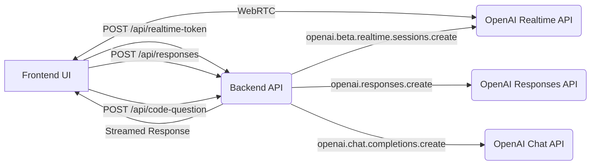

# Application Overview

This document provides a high-level overview of the Realtime API Agent application's core functionality, architecture, and API usage.

## Core Features & Flows

1.  **Realtime Audio Processing:**
    *   Captures user microphone input and system speaker output using the browser's WebRTC capabilities.
    *   Streams audio data to the OpenAI Realtime API for transcription.
    *   Managed by [`src/app/api/realtime-assistant-webRTC/webRTCConnectionManager.ts`](src/app/api/realtime-assistant-webRTC/webRTCConnectionManager.ts:0).

2.  **Transcript Display:**
    *   Displays user and assistant messages in a chat-like interface ([`src/components/Transcript.tsx`](src/components/Transcript.tsx:0)).
    *   Manages transcript state using [`src/contexts/TranscriptContext.tsx`](src/contexts/TranscriptContext.tsx:0).

3.  **Backend Processing & Response Generation:**
    *   When system audio (speaker) completes transcription, the transcript is sent to the backend API (`POST /api/responses`).
    *   The backend classifies the speaker transcript (Code, Behavioral, General) using `gpt-4o-mini`.
    *   Based on the classification (or if it's a follow-up), it selects an appropriate OpenAI model (`gpt-4o-mini` or `gpt-4.1-mini-2025-04-14`) and a specific tool (`format_comprehensive_code`, `format_behavioral_star_answer`, or `format_simple_explanation`).
    *   It calls the OpenAI Responses API (`openai.responses.create`) with the selected model, tool, and conversation history to generate a structured response.
    *   The response is streamed back to the frontend.

4.  **Multi-View Interface (`src/components/DraggablePanelLayout.tsx`):**
    *   **Main View:** Shows the primary conversation transcript.
    *   **Code View:** Displays code ([`EnhancedCodePane.tsx`](src/components/EnhancedCodePane.tsx:0)) and its corresponding analysis ([`EnhancedAnalysisPane.tsx`](src/components/EnhancedAnalysisPane.tsx:0)) side-by-side in resizable panels. Uses tabs ([`TabsPanel.tsx`](src/components/TabsPanel.tsx:0)) to manage multiple code snippets.
    *   **Behavioral View:** Displays STAR method answers ([`EnhancedAnalysisPane.tsx`](src/components/EnhancedAnalysisPane.tsx:0)) using tabs ([`TabsPanel.tsx`](src/components/TabsPanel.tsx:0)).
    *   View switching is triggered manually (Alt+Space) or automatically when selecting tabs.

5.  **Code Questions via Screenshot (Electron):**
    *   Allows capturing a screenshot and sending it with a text question to the backend (`POST /api/code-question`).
    *   The backend uses OpenAI's vision capabilities (`gpt-4o-mini` via the Chat Completions API) to analyze the image and question.
    *   Triggered from [`src/components/TopControls.tsx`](src/components/TopControls.tsx:0).

6.  **Settings & Configuration:**
    *   A modal ([`src/components/SettingsModal.tsx`](src/components/SettingsModal.tsx:0)) allows users to input/manage OpenAI API keys stored in `localStorage`.
    *   Provides connection status indicators and reconnection options.

7.  **State Management:**
    *   Uses React Context for managing shared state:
        *   [`ThemeContext`](src/contexts/ThemeContext.tsx:0): Manages UI theme (currently fixed to dark).
        *   [`StatusContext`](src/contexts/StatusContext.tsx:0): Tracks connection and chat processing states.
        *   [`TranscriptContext`](src/contexts/TranscriptContext.tsx:0): Manages conversation items displayed in the UI.
        *   [`EventContext`](src/contexts/EventContext.tsx:0): Logs client/server events (primarily for debugging), stored in `localStorage`.

## Context Management

*   Conversation context is managed primarily within the [`/api/responses`](src/app/api/responses/route.ts:0) backend route.
*   A simple **in-memory `Map`** (`conversationContextStore`) stores conversation history keyed by `conversationId`.
*   **Only assistant messages** (specifically, the final function call output) are currently stored in this map to maintain context for potential follow-up questions, particularly for behavioral responses.
*   User and system audio transcripts are passed into the API call as needed but are **not persisted** in the backend context store between requests. The application relies on the state managed by the OpenAI session itself for the immediate turn context.
*   Follow-up detection logic in the backend ([`detectFollowUp`](src/app/api/responses/route.ts:120)) uses the `lastQuestionType` stored in the context and keywords in the current transcript to determine if a new request relates to the previous assistant response.

## API Usage Details

*   **Frontend <-> Backend API (`/api/*` routes):**
    *   [`/api/realtime-token`](src/app/api/realtime-token/route.ts:0): Provides ephemeral tokens (client secrets) via `openai.beta.realtime.sessions.create`.
    *   [`/api/responses`](src/app/api/responses/route.ts:0): Core endpoint. Classifies speaker transcript, selects model/tool, calls `openai.responses.create`, streams response.
    *   [`/api/code-question`](src/app/api/code-question/route.ts:0): Handles screenshot analysis via `openai.chat.completions.create` (`gpt-4o-mini` vision).
*   **Frontend <-> OpenAI Realtime API:**
    *   Direct WebRTC connection managed by [`webRTCConnectionManager`](src/app/api/realtime-assistant-webRTC/webRTCConnectionManager.ts:0) for audio streaming and transcription events.
*   **Backend API <-> OpenAI APIs (within `/api/responses`):**
    *   **Classification:** Uses `openai.chat.completions.create` (`gpt-4o-mini`) for initial classification of the speaker's transcript.
    *   **Response Generation (`openai.responses.create`):**
        *   **CODE_QUESTION:** Uses `gpt-4o-mini` model with the `format_comprehensive_code` tool.
        *   **BEHAVIORAL_QUESTION:** Uses `gpt-4o-mini` model with the `format_behavioral_star_answer` tool.
        *   **GENERAL_QUESTION:** Uses `gpt-4.1-mini-2025-04-14` model with the `format_simple_explanation` tool.
        *   Tool choice is forced (`required`) based on classification.

## Key Components/Modules

*   **[`src/app/App.tsx`](src/app/App.tsx:0)**: Main application logic, state management orchestration.
*   **[`src/components/DraggablePanelLayout.tsx`](src/components/DraggablePanelLayout.tsx:0)**: Manages the different UI views (main, code, behavioral).
*   **[`src/components/TopControls.tsx`](src/components/TopControls.tsx:0)**: Handles WebRTC connection logic, mic mute, settings access, screenshot trigger.
*   **[`src/app/api/realtime-assistant-webRTC/webRTCConnectionManager.ts`](src/app/api/realtime-assistant-webRTC/webRTCConnectionManager.ts:0)**: Manages the low-level WebRTC connection details.
*   **[`src/app/api/responses/route.ts`](src/app/api/responses/route.ts:0)**: Backend logic for transcript classification, tool selection, context management, and calling the OpenAI Responses API.
*   **Contexts (`src/contexts/`)**: Provide shared state across the application.